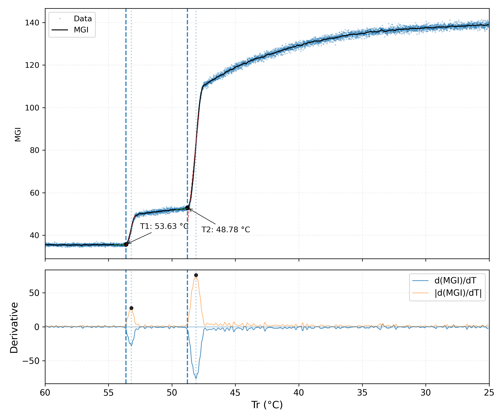
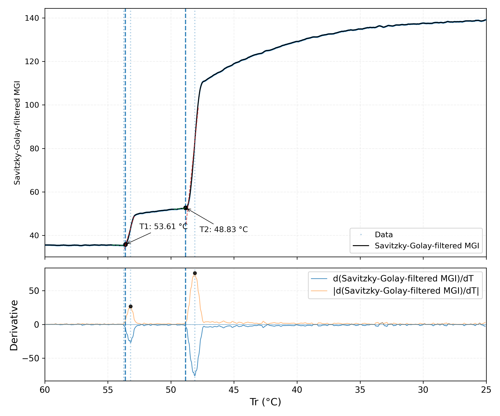

# PCHIP onset analysis

PCHIP-based onset-analysis workflow for cooling experiments with MGI/PCHIP,
FBRM, combined MGI-FBRM figures, batch processing, and static offline review
galleries.

The repository is designed as a practical, inspectable command-line workflow:
scripts produce documented output files, review figures, diagnostics, and
galleries that can be checked before scientific interpretation.

---

## 🔗 Quick links

- **Workflow overview:** [`docs/pipeline.md`](docs/pipeline.md)
- **Script overview:** [`docs/scripts.md`](docs/scripts.md)
- **Gallery generation:** [`docs/gallery.md`](docs/gallery.md)
- **FBRM onset detector:** [`docs/fbrm-onsets.md`](docs/fbrm-onsets.md)
- **PCHIP algorithm notes:** [`docs/xy-pchip-algorithm.md`](docs/xy-pchip-algorithm.md)
- **Synthetic RGB-TR example:** [`examples/synthetic-rgb-tr/`](examples/synthetic-rgb-tr/)
- **Example helper scripts:** [`examples/scripts/`](examples/scripts/)
- **Legacy scripts:** [`scripts/legacy/`](scripts/legacy/)

---

## 🧩 Key principles

- **Traceable:** outputs are written as CSV, JSON, TXT, PNG, and static HTML.
- **Reviewable:** publication figures, diagnostics, candidates, and galleries are kept separate.
- **Modular:** preprocessing, onset detection, combo figures, gallery generation, and cleanup can be run independently.
- **Batch-friendly:** the workflow runner can process full experiment trees.
- **Conservative:** scripts should not decide scientific validity automatically; review and configuration remain explicit.
- **KISS-oriented:** the workflow should remain understandable, reproducible, and practical.

---

## 📈 Example outputs

MGI/PCHIP diagnostic figures:

<p>
  
  
</p>

Static offline gallery of the current synthetic example (10 MGI/PCHIP images):


---

## ⚙️ Installation

Create or activate a Python environment and install the required packages:

```bash
python3 -m pip install -r requirements.txt
```

Typical dependencies:

```text
numpy
pandas
matplotlib
scipy
openpyxl
opencv-python-headless
```

---

## 🚀 Quick start

Show the main workflow runner help:

```bash
python3 scripts/run-onset-workflow.py --help
```

Print planned commands without running them:

```bash
python3 scripts/run-onset-workflow.py --project-root .
```

Run the default workflow:

```bash
python3 scripts/run-onset-workflow.py --project-root . --run
```

Run selected workflow steps:

```bash
python3 scripts/run-onset-workflow.py \
  --project-root . \
  --steps pchip,mgi,fbrm,combo,gallery \
  --run
```

The default workflow order is:

```text
pchip,mgi,fbrm,combo,gallery
```

---

## 🗂 Repository layout

```text
pchip-onset-analysis/
├── README.md
├── requirements.txt
├── docs/
│   ├── figures/
│   ├── gallery.md
│   ├── pipeline.md
│   ├── scripts.md
│   └── ...
├── examples/
│   ├── README.md
│   ├── scripts/
│   └── synthetic-rgb-tr/
└── scripts/
    ├── legacy/
    ├── xy-pchip.py
    ├── bw-pchip-onsets-t1t2.py
    ├── fbrm2csv.py
    ├── align_fbrm_tr.py
    ├── fbrm-onsets.py
    ├── make-mgi-fbrm-combo.py
    ├── make-onset-gallery.py
    ├── run-onset-workflow.py
    └── clean-onset-outputs.py
```

Some file names retain the historical `bw` prefix. In the documentation, the
corresponding signal is described as MGI.

---

## 🧪 Synthetic RGB-TR example

The compact example is under:

```text
examples/synthetic-rgb-tr/
```

Main example files:

```text
examples/synthetic-rgb-tr/rgb-tr.csv
examples/synthetic-rgb-tr/rgb-tr-sg.csv
examples/synthetic-rgb-tr/pchip/
```

The synthetic data are demonstration data only. They are not experimental
results and must not be used for scientific conclusions.

The script used to create the synthetic RGB-TR input is kept separately from
the compact analysis example:

```text
examples/scripts/make-synthetic-rgb-tr.py
```

---

## 🖼 Gallery generation

`make-onset-gallery.py` builds a static offline HTML review gallery from
existing workflow outputs.

Create a local review gallery with data/support links:

```bash
python3 scripts/make-onset-gallery.py <gallery-root> \
  --gallery-content all \
  --gallery-view base \
  --with-data \
  --output <gallery-root>/onset-gallery.html
```

Create a shareable image-only gallery tree:

```bash
python3 scripts/make-onset-gallery.py <gallery-root> \
  --gallery-content all \
  --gallery-view base \
  --export-image-tree /path/to/onset-gallery-share \
  --output onset-gallery.html
```

The image-only export keeps images as normal files and does not copy CSV, JSON,
or TXT support files. This is usually the most convenient format for sharing
review galleries.

For gallery layout requirements, limit-view examples, and export options, see
[`docs/gallery.md`](docs/gallery.md).

---

## 🛠 Main scripts

| Script | Purpose |
| --- | --- |
| `xy-pchip.py` | Create PCHIP-interpolated curve data from MGI/RGB temperature data. |
| `bw-pchip-onsets-t1t2.py` | Detect MGI/PCHIP onset temperatures and write result figures. |
| `fbrm2csv.py` | Convert FBRM export data to timestamped Total Counts CSV. |
| `align_fbrm_tr.py` | Align FBRM Total Counts with the experiment temperature axis. |
| `fbrm-onsets.py` | Detect FBRM Total Counts onset temperatures and write FBRM figures. |
| `make-mgi-fbrm-combo.py` | Create combined MGI/FBRM onset figures. |
| `make-onset-gallery.py` | Build static offline review galleries from existing outputs. |
| `run-onset-workflow.py` | Run the multi-step workflow in batch mode. |
| `clean-onset-outputs.py` | Archive or remove generated workflow outputs safely. |

For the full script list and directory-discovery details, see
[`docs/scripts.md`](docs/scripts.md).

---

## Saved-result publication and supplementary rendering

See [current method and parameter rules](docs/current-method.md) and
[publication/supplementary commands](docs/publication-rendering.md).
The MGI and FBRM production detectors are distinct methods; FBRM does not
use the experimental PCHIP adapter. Rendering never selects new onsets.

Run the synthetic regression suite with:

```bash
python3 -m unittest discover -s tests -v
```

For separate code and data trees, `--project-root` identifies this repository
(with `scripts/`) and `--data-root` identifies the experiment tree. When omitted,
the data root equals the project root. The legacy `{bin}` template variable
now resolves to the active repository `scripts/` directory.

Only synthetic examples belong in this public repository. Keep private inputs,
scientific outputs, publication PNGs, manifests and review exports outside Git.
See [publication policy](docs/publication-policy.md).

## 🧭 Workflow documentation

The repository documentation uses Mermaid diagrams for the public workflow
description:

```text
docs/pipeline.md
docs/pipeline.mmd
```

Legacy gallery scripts are kept under `scripts/legacy/` for traceability with
earlier workflow variants. New gallery generation uses
`scripts/make-onset-gallery.py`.

---

## 📝 Notes

- PCHIP is used as interpolation, not smoothing.
- Onset counts and validity decisions should be controlled by configuration and review.
- The gallery is a review and quality-control output, not the primary scientific result figure.
- Generated outputs should normally stay out of version control unless they are small, intentional examples.
