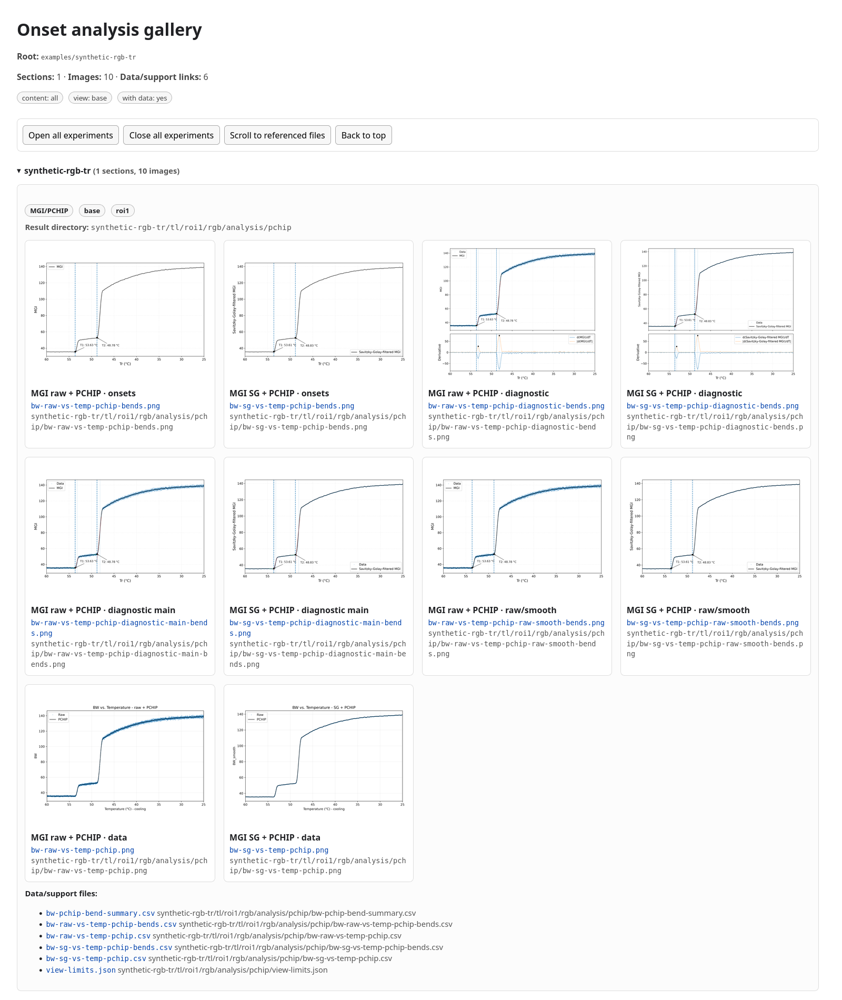

# Onset analysis gallery

`make-onset-gallery.py` builds a static offline HTML review gallery from
existing workflow outputs.

The gallery is an index and review layer. It does not calculate onsets, redraw
analysis figures, modify analysis results, or feed back into the onset-detection
workflow.



## Input layout

The unified gallery generator discovers active workflow outputs from the normal
experiment-tree layout:

```text
<gallery-root>/<experiment>/tl/roi*/rgb/analysis/pchip/
<gallery-root>/<experiment>/tl/roi*/rgb/analysis/fbrm_onsets/
<gallery-root>/<experiment>/tl/roi*/rgb/analysis/combo/
```

Limit-view outputs use the corresponding `views/<view-id>/` subdirectories:

```text
<gallery-root>/<experiment>/tl/roi*/rgb/analysis/pchip/views/<view-id>/
<gallery-root>/<experiment>/tl/roi*/rgb/analysis/fbrm_onsets/views/<view-id>/
<gallery-root>/<experiment>/tl/roi*/rgb/analysis/combo/views/<view-id>/
```

For the expanded layout explanation and the compact-example note, see
`scripts.md`.

## Shareable image-only gallery

For sharing review galleries with collaborators, use `--export-image-tree`.
This creates a self-contained directory containing the HTML file and the image
files referenced by the gallery.

This is usually the preferred sharing format:

- images remain as normal image files
- the HTML stays small
- CSV/JSON/TXT support files are not copied
- the directory can be compressed and sent as one package

Omit `--with-data`, `--export-data`, and `--embed-images` for an image-only
sharing package.

Example:

```bash
gallery_root=/path/to/data/examples
share_root=/path/to/data/onset-gallery-share

# Choose a fresh export directory; do not overwrite an existing package.

python3 scripts/make-onset-gallery.py "$gallery_root" \
  --gallery-content all \
  --gallery-view base \
  --export-image-tree "$share_root" \
  --root-label synthetic-examples \
  --output onset-gallery.html
```

Open the exported gallery:

```bash
firefox "file://$share_root/onset-gallery.html"
```

Create a portable ZIP package (HTML and original PNGs remain together):

```bash
(cd "$(dirname "$share_root")" && zip -r "$(basename "$share_root").zip" "$(basename "$share_root")")
```

Alternatively, on Unix systems:

```bash
tar -C "$(dirname "$share_root")" \
  -caf "$share_root.tar.xz" \
  "$(basename "$share_root")"
```

Use `--force-export-overwrite` only when intentionally writing into an existing
non-empty export directory.

## Shareable gallery with images and support data

Use `--export-image-tree --export-data` to create a shareable gallery package
that contains the HTML file, referenced gallery images, and referenced
CSV/JSON/TXT support files.

This is not an embedded HTML gallery. Images remain as normal image files.
The export does not copy the original time-lapse image sequence; it copies only
files referenced by the gallery.

Example:

```bash
gallery_root=/path/to/data/examples
share_root=/path/to/data/onset-gallery-share-with-data

# Choose a fresh export directory; do not overwrite an existing package.

python3 scripts/make-onset-gallery.py "$gallery_root" \
  --gallery-content all \
  --gallery-view base \
  --export-image-tree "$share_root" \
  --root-label synthetic-examples \
  --export-data \
  --output onset-gallery.html
```

## Review gallery with data links

Use `--with-data` when the gallery should include links to CSV, JSON, and text
support files next to the images.

```bash
python3 scripts/make-onset-gallery.py <gallery-root> \
  --gallery-content all \
  --gallery-view base \
  --with-data \
  --output <gallery-root>/onset-gallery.html
```

This mode keeps links relative to the generated HTML file. It is useful for
local review when the analysis tree is available.

## Limit-view galleries

Generate all discovered limit-view outputs:

```bash
python3 scripts/make-onset-gallery.py <gallery-root> \
  --gallery-content all \
  --gallery-view limited \
  --with-data \
  --output <gallery-root>/onset-gallery-limited.html
```

Generate one specific limit view:

```bash
python3 scripts/make-onset-gallery.py <gallery-root> \
  --gallery-content all \
  --gallery-view limited \
  --view-id x_45-57__mgi_auto__fbrm_auto \
  --with-data \
  --output <gallery-root>/onset-gallery-x_45-57.html
```

## MGI/PCHIP-only gallery

Generate only MGI/PCHIP base outputs:

```bash
python3 scripts/make-onset-gallery.py <gallery-root> \
  --gallery-content mgi \
  --gallery-view base \
  --with-data \
  --output <gallery-root>/mgi-gallery.html
```

## Compact synthetic example

The compact synthetic example is stored as:

```text
examples/synthetic-rgb-tr/rgb-tr.csv
examples/synthetic-rgb-tr/rgb-tr-sg.csv
examples/synthetic-rgb-tr/pchip/
```

To reproduce the documentation gallery using only committed synthetic results,
run from the repository root (use a fresh `work` directory):

```bash
work=generated/synthetic-gallery
mkdir -p "$work/synthetic-rgb-tr/tl/roi1/rgb/analysis"
cp -a examples/synthetic-rgb-tr/pchip \
  "$work/synthetic-rgb-tr/tl/roi1/rgb/analysis/pchip"
python3 scripts/make-onset-gallery.py "$work" \
  --gallery-content all \
  --gallery-view base \
  --with-data \
  --root-label examples/synthetic-rgb-tr \
  --open-all \
  --output onset-gallery.html
```

Open `generated/synthetic-gallery/onset-gallery.html` offline. All image and
support links are relative, so the directory can be moved or shared intact.
`--root-label` changes only the displayed root name, not discovery or links.

The example gallery contains **10 MGI/PCHIP images**: RAW and SG versions of
onsets, diagnostics, diagnostic main, raw/smooth, and PCHIP data plots.
`rgb-tr-sg.png` is deliberately excluded: it is a preprocessing quick-look,
whose legacy bend markers are not the final PCHIP onset results.
The documentation screenshot captures the gallery content without browser chrome.

## Related files

```text
scripts/make-onset-gallery.py
docs/figures/gallery-screenshot.png
```
