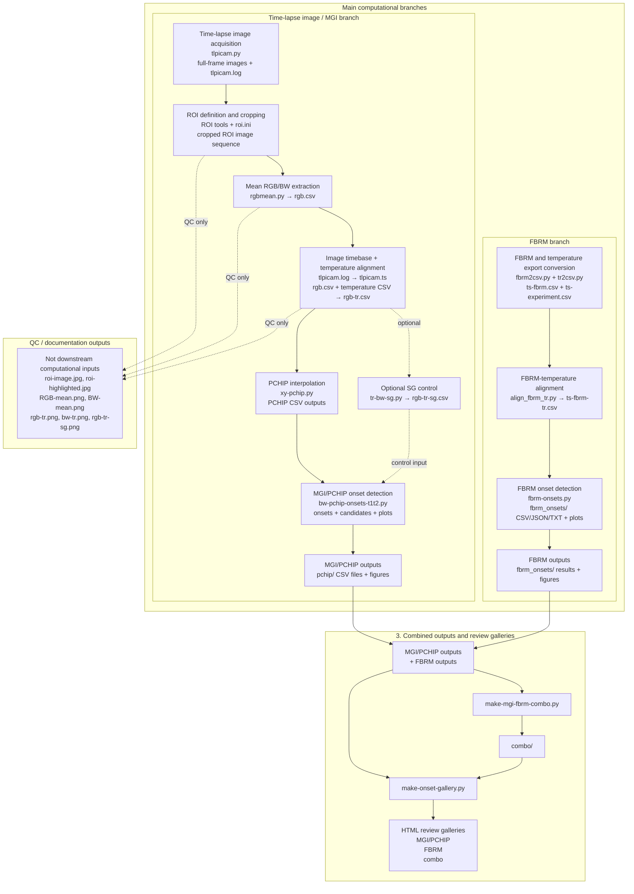

# PCHIP / MGI / FBRM analysis pipeline

This document describes the repository-level workflow for processing time-lapse image data, FBRM Total Counts data, and combined MGI-FBRM comparison outputs.

The workflow is shown at method and script level to make the processing chain reproducible. The main computational path is separated from quality-control outputs and review galleries.

## 1. Workflow diagram



## 2. Scope

The experiment produces two parallel data streams:

1. a time-lapse image stream used for Mean Gray Intensity (MGI/BW) analysis, and
2. an FBRM Total Counts stream used for independent particle-count onset analysis.

The two streams are processed separately up to their respective onset-detection stages. They are combined only after both MGI/PCHIP and FBRM onset results have been generated.

```text
Experiment
├── Time-lapse image / MGI stream
│   └── ROI image analysis → rgb-tr.csv → PCHIP → MGI/PCHIP onsets
│
├── FBRM stream
│   └── FBRM export → ts-fbrm-tr.csv → FBRM onsets
│
└── Combined comparison
    └── MGI/PCHIP outputs + FBRM outputs → MGI-FBRM combo outputs and HTML review galleries
```

## 3. Time-lapse image / MGI branch

### 3.1 Time-lapse image acquisition

The time-lapse acquisition stage captures the original full-frame image sequence and records the acquisition metadata.

```text
tlpicam.py
    ├── full-frame time-lapse images
    └── tlpicam.log
```

`tlpicam.log` documents the acquisition settings and timing information, including camera settings, image interval, image format, time-lapse start and end times, duration, and number of captured frames.

### 3.2 ROI definition and cropping

The region of interest is defined from a representative full-frame image. The essential metadata output of this stage is `roi.ini`.

```text
full-frame image sequence
    └── ROI definition
            └── roi.ini

full-frame image sequence + roi.ini
    └── ROI batch cropping
            └── cropped ROI image sequence
```

`roi.ini` contains the selected ROI coordinates in the original image coordinate system and, where available, normalized ROI coordinates.

### 3.3 Mean RGB/BW extraction

Mean RGB and BW values are calculated from each cropped ROI image.

```text
cropped ROI image sequence
    └── rgbmean.py
            └── rgb.csv
```

`rgb.csv` is the required numerical output of this stage. It contains the per-image mean BW/R/G/B values.

### 3.4 Image timebase and temperature alignment

The image timebase is reconstructed from the time-lapse log and then aligned with the experiment temperature data.

```text
tlpicam.log
    └── tlpicam2ts.py
            └── tlpicam.ts

rgb.csv + tlpicam.ts + experiment temperature CSV
    └── tr2rgb.py
            └── analysis/rgb-tr.csv
```

`tlpicam.ts` maps image number to datetime, timestamp, and elapsed time.

`rgb-tr.csv` is the primary input for the MGI/PCHIP analysis branch. It contains image number, timestamp, elapsed time, temperature, BW, and RGB values.

### 3.5 Optional SG diagnostic/control series

A Savitzky-Golay-smoothed control series may be generated from the aligned image-temperature data.

```text
rgb-tr.csv
    └── tr-bw-sg.py
            └── rgb-tr-sg.csv
```

`rgb-tr-sg.csv` is not the primary analysis input. It is used as a diagnostic/control series to compare raw-MGI/PCHIP and SG-MGI/PCHIP behavior.

## 4. MGI/PCHIP analysis branch

### 4.1 PCHIP interpolation

The primary MGI/BW signal is converted to BW versus temperature and interpolated using PCHIP.

```text
rgb-tr.csv
    └── xy-pchip.py
            └── pchip/bw-raw-vs-temp-pchip.csv
```

If the optional SG control series is available, it can be processed in parallel.

```text
rgb-tr-sg.csv
    └── xy-pchip.py
            └── pchip/bw-sg-vs-temp-pchip.csv
```

The raw-MGI/PCHIP result is the primary method. The SG-MGI/PCHIP result is used mainly as a diagnostic/control comparison.

### 4.2 MGI/PCHIP onset detection

MGI/PCHIP onset detection is performed from the PCHIP output files.

```text
pchip/bw-raw-vs-temp-pchip.csv
pchip/bw-sg-vs-temp-pchip.csv
    └── bw-pchip-onsets-t1t2.py
            ├── onset result CSV files
            ├── candidate diagnostic CSV files
            ├── diagnostic plots
            └── publication plots
```

The onset detector reports up to the requested number of physically meaningful onsets. For the standard T1/T2 workflow, this means reporting 0, 1, or 2 accepted onsets; two onsets are not forced if the data do not support them.

## 5. FBRM branch

### 5.1 FBRM and temperature export conversion

The original FBRM/iCalc export is converted to a timestamped Total Counts CSV file, and the experiment temperature data are converted to a timestamped temperature CSV file.

```text
FBRM/iCalc XLSX export
    └── fbrm2csv.py
            └── ts-fbrm.csv

experiment temperature XLSX export
    └── tr2csv.py
            └── ts-experiment.csv
```

`ts-fbrm.csv` contains timestamped FBRM Total Counts values. `ts-experiment.csv` is used here as a generic name for the timestamped experiment temperature CSV, including `Tr (°C)`.

### 5.2 FBRM-temperature alignment

FBRM Total Counts are aligned with the experiment temperature axis.

```text
ts-fbrm.csv + ts-experiment.csv
    └── align_fbrm_tr.py
            └── ts-fbrm-tr.csv
```

`ts-fbrm-tr.csv` is the primary input for the final FBRM onset analysis. It preserves the FBRM measurement order and provides the measured/interpolated temperature value for each FBRM timestamp.

### 5.3 FBRM onset detection

FBRM onset detection is performed directly from the aligned FBRM-temperature data.

```text
ts-fbrm-tr.csv
    └── fbrm-onsets.py
            ├── fbrm_onsets/fbrm-onsets.csv
            ├── fbrm_onsets/fbrm-onset-candidates.csv
            ├── fbrm_onsets/fbrm-onset-params.json
            ├── fbrm_onsets/fbrm-onset-report.txt
            ├── diagnostic plots
            └── publication plots
```

The FBRM detector preserves the original measurement order. It uses the measured/interpolated `Tr (°C)` axis and does not use `Tr_regular`.

By default, the onset search is stopped at the high-count search limit, raw Total Counts = 10000, unless explicitly configured otherwise.

## 6. Combined MGI-FBRM comparison

After the MGI/PCHIP and FBRM onset analyses have been completed, the two result branches are combined for visual comparison.

```text
MGI/PCHIP outputs + FBRM outputs
    └── make-mgi-fbrm-combo.py
            └── combo/
```

Typical inputs include:

```text
pchip/bw-raw-vs-temp-pchip.csv
pchip/bw-raw-vs-temp-pchip-bends.csv
fbrm_onsets/fbrm-onsets.csv
fbrm_onsets/fbrm-onset-params.json
ts-fbrm-tr.csv
```

The combined plots are comparison outputs. They do not replace the separate MGI/PCHIP and FBRM onset analyses.

## 7. HTML review galleries

After all experiment-level analyses have been completed, HTML review galleries are generated.

```text
make-onset-gallery.py
    └── galleries/onset-gallery.html
```

The galleries provide a structured overview of:

```text
1. MGI/PCHIP analysis outputs
2. FBRM onset-analysis outputs
3. combined MGI-FBRM comparison outputs
```

The HTML galleries are review and quality-control outputs. They collect existing results but do not affect the onset-detection results and are not computational inputs to the analysis.

## 8. QC outputs versus computational dependencies

Several images and intermediate plots are useful for human inspection but are not required inputs for the downstream computational analysis.

Examples include:

```text
roi-image.jpg
roi-highlighted.jpg
RGB-mean.png
BW-mean.png
rgb-tr.png
bw-tr.png
rgb-tr-sg.png
```

These files help verify that the ROI, image sequence, BW signal, and temperature alignment are reasonable. They should be treated as QC/documentation outputs, not as required computational dependencies.
